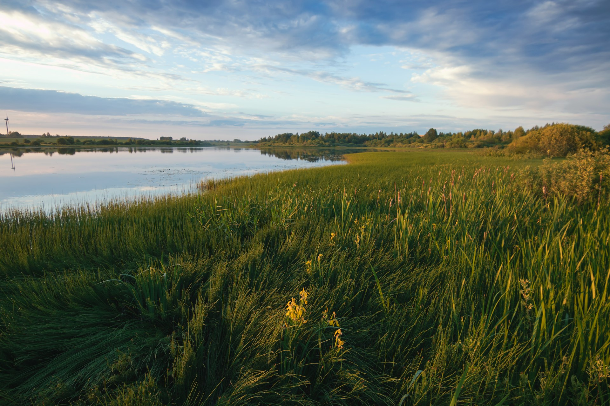

# Marsh Marvels
  
## And quietly flows the Yamuna

### Welcome to another world

This is an attempt to document the ecosystem in the Yamuna Wetlands, one tiny species at a time. A series of walks are the means of collection of data. Will they suffice or not remains to be seen.

>*“If I were to name the three most precious resources of life, I should say books, friends, and nature....”*

### Observations
  
  * [Plants](plants_index.md)
  * [Animals](animals_index.md)
  * [Diary](observations.md)

### About Me
Interested in knowing how and why this project started. Click here to know more about me.

* [About Me](about.md)

## Navigation Links
