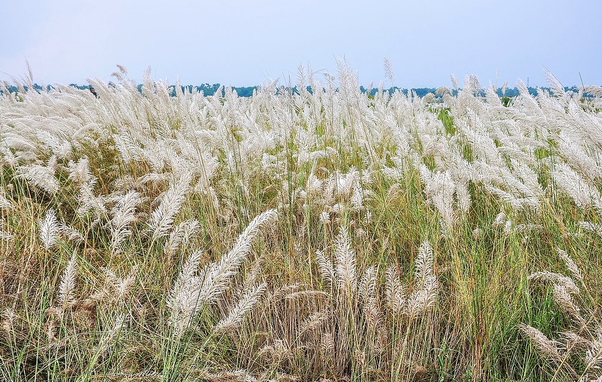

# Kans Grass

*Saccharum spontaneum* otherwise known as wild sugarcane, Kans grass is a grass[^1] native throughout tropical and subtropical Asia, northern Australia and east and north Africa. Perennial in nature, height often reaches 3 metres and has spreading rhizomatous[^2] roots. 

## Scientific classification

* Kingdom: Plantae
* Clade: Tracheophytes
* Clade: Angiosperms
* Clade: Monocots
* Clade: Commelinids
* Order: Poales
* Family: Poaceae
* Subfamily: Panicoideae
* Genus: Saccharum
* Species: S. spontaneum

## Classifications and Characteristics

* Plant Division    :    Angiosperms
* Plant Growth Form :    Grass or Grass-like plant
* Lifespan          :    Perennial
* Mode of Nutrition :    Autotrophic
* Plant Shape       :    Irregular
* Maximum height    :    2m to 4m

## Biogeography

|               |               |
| :---          |   :---        |
|**Native Distribution**|   Tropical and sub tropical Asia, Indian Subcontinent, Northern Australia and East and North Africa|
|**Habitat**            |   Coastal Forest, Riverine, Grassland, Savannah, Disturbed Area, open Ground, Desert, Semi-Desert, Shorelines|
|**Preferred Climate**  |   Tropical, Sub-Tropical, Monsoonal, Temperate, Mediterranean, Desert/Arid|

## References

[^1]: Grasses are 
[^2]: Rhizomatous roots are also grown in plants.
